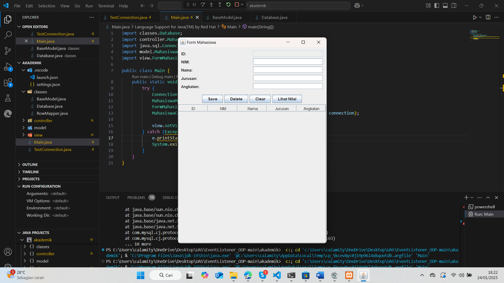
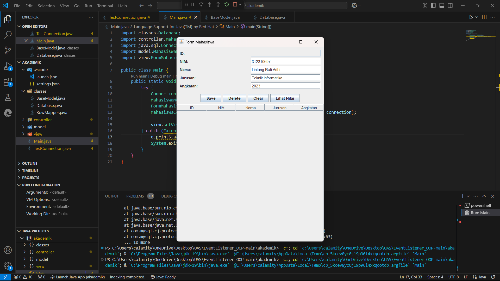
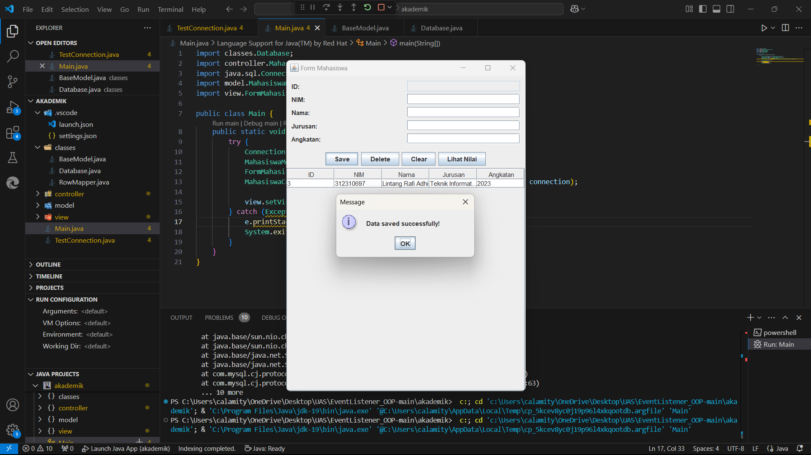

# Project OOP Berbasis MVC
## $${\color{lightblue}Link-Penjelasan-Youtube}$$
[Link Penjelasan Proses Pembuatan Program | YouTube](https://youtu.be/_mrrsYQ3)

  

| Variable           |             Isi            |
| -------------------|----------------------------|
| **Nama**           |     Lintang Rafi Adhi      |
| **NIM**            |          312310697         |
| **Kelas**          |          TI.23.A.6         |
| **Mata Kuliah**    | Pemrograman Orientasi Objek|
| **Dosen Pengampu** |Agung Nugroho S.kom., M.Kom.|

  

### <b>TUGAS 1 UAS PEMROGRAMAN ORIENTASI OBJEK</b>

   

### <b>TUGAS 2 UAS PEMROGRAMAN ORIENTASI OBJEK</b>

   

### Tampilan Awal Program Saat Dijalankan / Dirunning

Pada saat program dijalankan / di running akan menghasilkan output seperti diatas ini
- Menampilkan Form Mahasiswa utama dengan tabel yang berisi data 4 mahasiswa
- Data yang ditampilkan: ID, NIM, Nama, Jurusan, dan Angkatan
- Memiliki field kosong di atas untuk input data baru
- Terdapat 4 tombol: Save, Delete, Clear, dan Lihat Nilai

   

### Tampilan Ketika Penambahan Data Mahasiswa

berikut adalah proses penambahan mahasiswa baru dengan field yang diisi adalah bagian `NIM`, `Nama`, `Jurusan`, `Angkatan`.

   

### Tampilan Ketika Penambahan Data Mahasiswa Berhasil

Pada saat setelah mengklik tombol `Save`, muncul popup dengan pesan `"Data saved successfully!"`. Menandakan data mahasiswa baru berhasil disimpan ke database.

   

### Tampilan Ketika Menambahkan Sebuah Data Nilai Dari Mahasiswa

- Muncul form baru Data Nilai Mahasiswa : Rahmat Cihuy (312220676).
- Mengisi field `Mata Kuliah` `Semester` `Nilai`.

   

### Tampilan Ketika Data Nilai Berhasil Disimpan 

Setelah klik Save, muncul popup `Nilai berhasil disimpan!`.

   

### Tampilan Ketika Setelah Selesai Penambahan Data Nilai

- Data nilai yang baru diinput muncul di tabel nilai
- Menampilkan `ID (8)`, `Mata Kuliah (Pemrograman Web 1)`, `Semester (3)`, dan `Nilai (87)`.

 

Program ini menggunakan konsep form management yang baik dengan validasi data dan feedback user melalui popup messages. Interface dibuat user-friendly dengan tabel untuk menampilkan data dan form input yang jelas.
